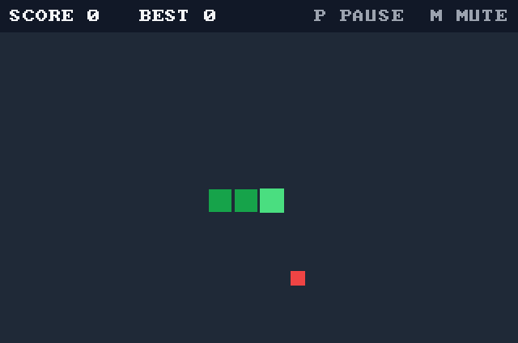

# snake-game

[](https://github.com/Tonyc310/snake-game/actions/workflows/ci.yml)

Snake, built as one unit-tested game core with interchangeable front ends. The rules live in `core/` as plain C with no I/O; each front end only reads input and draws the game, so every version plays by exactly the same tested rules.

There are two front ends: a desktop game (SDL3) for Linux, Windows, and macOS, and a terminal game (ncurses). Both share:

- Speeds up as the snake eats, from 150 ms per step down to 60 ms
- Score and best score for the session
- Fixed-size board and snake buffer; no allocation during play

## Desktop version



- Arrow keys or WASD to steer, `P` to pause, `R` to restart, `M` to mute, `Q` or `Esc` to quit
- Resizable window; the board scales to fit and keeps its shape
- Sound effects generated in code, so there are no audio files
- Pauses itself when the window loses focus

## Terminal version

```
┌────────────────────────────────────────┐
│                                        │
│                        @               │
│                        o               │
│                  *     o               │
│                        o               │
│                        o               │
│                        o               │
│                        o               │
│                        o               │
│                        o               │
│                        o               │
│                        o o             │
└────────────────────────────────────────┘
score 9   best 9
arrows/WASD steer, p pause, q quit
```

- Arrow keys or WASD to steer, `p` to pause, `r` to restart, `q` to quit
- Pauses itself if the terminal becomes too small to show the board

## Requirements

- CMake 3.20+ and a C11 compiler: GCC, Clang, or Visual Studio 2022 or newer
- Desktop: SDL3 3.2 or newer (`brew install sdl3` on macOS). Where SDL3 isn't installed, configure with `-DSNAKE_FETCH_SDL3=ON` and CMake downloads and builds it. On Linux that build needs the X11 headers, plus the ALSA or PulseAudio headers for sound:
  ```bash
  sudo apt install libx11-dev libxext-dev libxcursor-dev libxfixes-dev libxi-dev \
    libxrandr-dev libxss-dev libxtst-dev libasound2-dev libpulse-dev
  ```
- Terminal: ncurses headers (`libncurses-dev` on Debian/Ubuntu) and a terminal of at least 42×16. Not built on Windows, which has no curses.

## Build and play

Linux and macOS:

```bash
cmake -B build && cmake --build build
./build/desktop/desktop-snake
./build/terminal/terminal-snake
```

Windows:

```powershell
cmake -B build -DSNAKE_FETCH_SDL3=ON
cmake --build build --config Release
build\desktop\Release\desktop-snake.exe
```

Each front end is built only when its library is found; CMake's output names any it skipped.

## Test

```bash
ctest --test-dir build --output-on-failure   # add -C Release on Windows
```

CI builds and tests on Linux, Windows (MSVC), and macOS, and runs the tests under AddressSanitizer and UndefinedBehaviorSanitizer with GCC and Clang.

## Layout

```
core/       game rules: movement, food, collisions, score, speed (no I/O)
desktop/    SDL3 front end: drawing, input, timing, sound
terminal/   ncurses front end: drawing, input, timing
tests/      Unity tests for core/
```

## License

MIT
