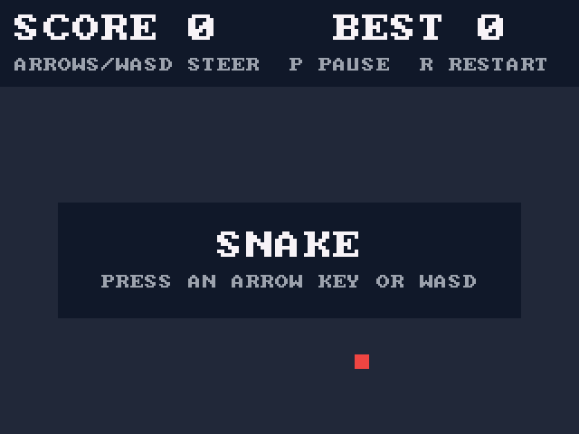

# snake-game

[](https://github.com/Tonyc310/snake-game/actions/workflows/ci.yml)

Snake, built as one unit-tested game core with interchangeable front ends. The rules live in `core/` as plain C with no I/O; each front end only reads input and draws the game, so every version plays by exactly the same tested rules.

There are three front ends: a desktop game (SDL3) for Linux, Windows, and macOS, a terminal game (ncurses), and firmware for an STM32 board with a small SPI display. All of them share:

- Speeds up as the snake eats, from 150 ms per step down to 60 ms
- Score and best score for the session
- Fixed-size board and snake buffer; no allocation during play

## Desktop version


- Arrow keys or WASD to steer, `P` to pause, `R` to restart, `M` to mute, `Q` or `Esc` to quit
- Resizable window; the board scales to fit and keeps its shape
- Sound effects generated in code, so there are no audio files
- Pauses itself when the window loses focus

## Terminal version

```
┌────────────────────────────────────────┐
│                                        │
│                        @               │
│                        o               │
│                  *     o               │
│                        o               │
│                        o               │
│                        o               │
│                        o               │
│                        o               │
│                        o               │
│                        o               │
│                        o o             │
└────────────────────────────────────────┘
score 9   best 9
arrows/WASD steer, p pause, q quit
```

- Arrow keys or WASD to steer, `p` to pause, `r` to restart, `q` to quit
- Pauses itself if the terminal becomes too small to show the board

## Requirements

- CMake 3.20+ and a C11 compiler: GCC, Clang, or Visual Studio 2022 or newer
- Desktop: SDL3 3.2 or newer (`brew install sdl3` on macOS). Where SDL3 isn't installed, configure with `-DSNAKE_FETCH_SDL3=ON` and CMake downloads and builds it. On Linux that build needs the X11 headers, plus the ALSA or PulseAudio headers for sound:
  ```bash
  sudo apt install libx11-dev libxext-dev libxcursor-dev libxfixes-dev libxi-dev \
    libxrandr-dev libxss-dev libxtst-dev libasound2-dev libpulse-dev
  ```
- Terminal: ncurses headers (`libncurses-dev` on Debian/Ubuntu) and a terminal of at least 42×16. Not built on Windows, which has no curses.

## Build and play

Linux and macOS:

```bash
cmake -B build && cmake --build build
./build/desktop/desktop-snake
./build/terminal/terminal-snake
```

Windows:

```powershell
cmake -B build -DSNAKE_FETCH_SDL3=ON
cmake --build build --config Release
build\desktop\Release\desktop-snake.exe
```

Each front end is built only when its library is found; CMake's output names any it skipped.

## Test

```bash
ctest --test-dir build --output-on-failure   # add -C Release on Windows
```

These cover the core and the STM32 front end's plain-C parts: key decoding, number formatting, and redrawing after a banner. CI builds and tests on Linux, Windows (MSVC), and macOS, runs the tests under AddressSanitizer and UndefinedBehaviorSanitizer with GCC and Clang, and builds the STM32 firmware and runs its Renode tests.

## STM32 version



Bare-metal firmware for a NUCLEO-F446RE with a 2.4" or 2.8" ILI9341 SPI display (320×240), written against CMSIS registers with no vendor HAL. You steer from a serial terminal over the board's ST-LINK USB port.

- Arrow keys or WASD to steer, `P` to pause, `R` to restart
- The display holds the picture, so the firmware keeps no frame buffer: each step sends only the two or three cells that changed
- The F446 has no random-number generator, so the timing of the first key press seeds each game
- The UART driver is [stm32-uart-driver](https://github.com/Tonyc310/stm32-uart-driver), fetched at a tagged release
- About 6 KB of flash and 3 KB of RAM

It's developed and tested in the [Renode](https://renode.io) simulator. Renode has no model of this display, so [stm32/renode/Ili9341.cs](stm32/renode/Ili9341.cs) adds one: it decodes the commands the firmware sends and behaves like a real panel where that catches bugs, such as dropping pixels sent before the pixel format is set. **It hasn't run on real hardware yet.** The driver follows the ILI9341 datasheet and the pins below match the board's Arduino header, but the picture's orientation and the panel's setup still need a real board to confirm.

### Wiring

| Display pin | Nucleo pin |
|---|---|
| VCC | 3V3 |
| GND | GND |
| CS | D10 (PB6) |
| RESET | D8 (PA9) |
| DC | D9 (PC7) |
| SDI (MOSI) | D11 (PA7) |
| SCK | D13 (PA5) |
| LED | 3V3 |
| SDO (MISO) | not connected |

The green LED (LD2) shares D13 with the SPI clock, so it flickers while the screen updates.

### Build and run

Needs CMake 3.21+, `arm-none-eabi-gcc` with newlib (`gcc-arm-none-eabi libnewlib-arm-none-eabi` on Debian/Ubuntu), and Renode 1.17 for the simulator.

```bash
cmake --preset stm32 && cmake --build --preset stm32
renode stm32/renode/snake.resc    # type `start`, then play in the usart2 window
```

On the board, flash the firmware and open the ST-LINK serial port at 115200 baud:

```bash
openocd -f board/st_nucleo_f4.cfg -c "program build/stm32/stm32/stm32-snake.elf verify reset exit"
picocom -b 115200 /dev/ttyACM0
```

### Tests

The Robot Framework tests in `stm32/renode/` boot the firmware in Renode, type keys into its serial port and compare the screen with reference frames: the opening board, steering, pause, game over and restart. They need `renode-test` on `PATH` with its Python packages (`pip install -r <renode>/tests/requirements.txt`), and `libgdiplus`, which Renode's frame tester uses to load the PNGs:

```bash
ctest --test-dir build/stm32 --output-on-failure
```

## Layout

```
core/           game rules: movement, food, collisions, score, speed (no I/O)
desktop/        SDL3 front end: drawing, input, timing, sound
terminal/       ncurses front end: drawing, input, timing
stm32/          STM32 firmware: display driver, drawing, serial keys, game loop
stm32/renode/   ILI9341 model, board description, Robot tests and reference frames
tests/          Unity tests for core/ and the STM32 front end's plain-C parts
```

## License

MIT
